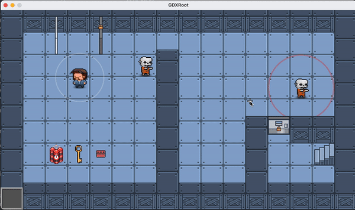
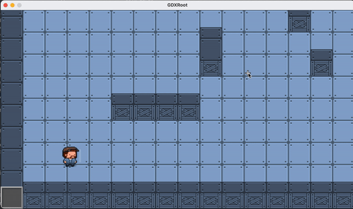
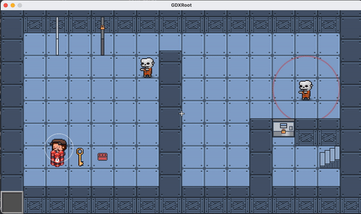
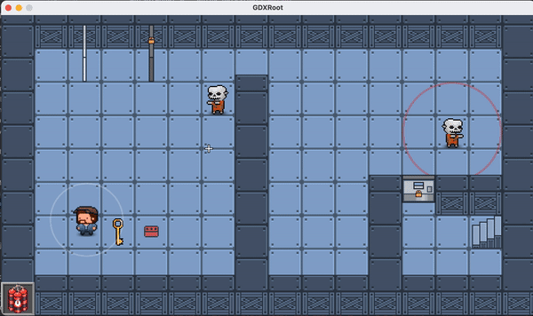
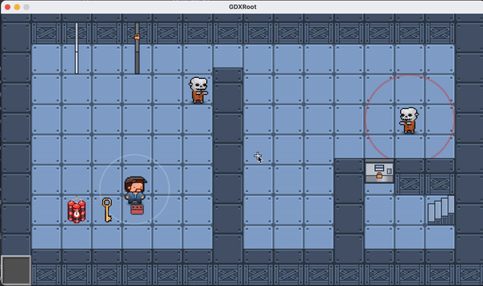
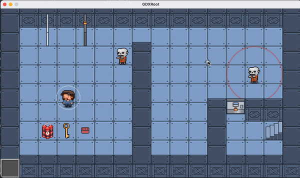
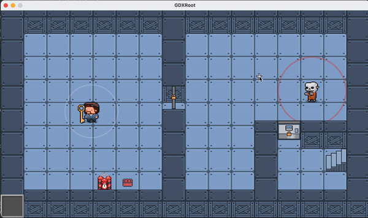

### Oops! All Programers (Team 7)

Marcos Eizayaga (me437) | Project Lead 
Jonathan Gomez (jdg274) | Software Lead 
Amy Wang | Design Lead 
Isaac Newcomb | Sound Lead 
Mitchell Lin (ml887) | Programmer & Designer 
Judy Ng (jsn59) | Programmer & Designer 
Will Spencer (wes229) | Programmer 
Elaine Zheng (ez229) | Programmer 
Eli Zhang (ekz5) | Programmer 

<h2 id="download-link">Meet our team</h2>

We're a team of Cornell students who are taking CIS 3152 - Intro to Game Design.
We're very proud of our game _Graveyard Shift_.

## Download

As most modern browsers block downloads from non-notarized sites you must download the game through github. Click on the links below and you will see a download button, please click that to download. Thank you!

[Mac Download](apps/GraveyardShiftMac.zip)

[Windows64 Download](apps/GraveyardShiftWindows.zip)

# Description

Steve the Janitor stirs from a long nap in his closet to an eerie silence. He finds the entire underground lab abandoned except for the failed lab experiments. Guide Steve to the surface, evading the mutants that can hear—but not see—everything Steve does.

## Objective

Get to the stairs before the mutants get you!

## Controls

This game is meant to be played with a keyboard and a mouse.

### Movemenent

|  KEY   | OUTPUT |
| :----: | :----: |
|   W    |   UP   |
|   A    |  LEFT  |
|   S    |  DOWN  |
|   D    | RIGHT  |
| LEFT ⇧ | SPRINT |

#### Walking | WASD

The player controlls steve by pressing WASD

#### Running | LEFT ⇧ + (WASD)

The player controlls steve by pressing Left Shift and WASD

_Note: Sound radius is larger when running_

_Note: Sprinting only lasts for a short while_

_Note: Panting makes you make more noise_

### Item Interaction

|          KEY          |                  OUTPUT                  |
| :-------------------: | :--------------------------------------: |
|           E           |                DROP ITEM                 |
|         SPACE         |     PICK UP ITEM & OPEN/CLOSE DOORS      |
|    MOUS LEFT CLICK    |       USE ITEM & OPEN/CLOSE DOORS        |
| HOLD MOUSE LEFT CLICK | PREVIEW THROW DIRECTION & BOMB PLACEMENT |
|           Q           |             CANCEL ITEM USE              |

#### Picking up and Using Item | E, SPACE, MOUSE

The player can pick up items by pressing SPACE and use them by pressing MOUSE LEFT CLICK.

- KEY MOUSE CLICK throws **brick**, activates **bomb** and unlocks door with **key**.

- MOUSE POS is used for **brick** direction and **bomb** placement direction

  - The bomb is placed in a 1 tile radius around you closest to your mouse position

- HOLDING DOWN MOUSE CLICK shows the direction of **brick** throwing

##### Picking up Items

##### Using bomb

##### Using brick

##### Using key

### Level and Screen Interactions

|     KEY      |      OUTPUT       |
| :----------: | :---------------: |
|     ESC      | GOES BACK TO MENU |
| MOUSE CLICK  |   PRESS BUTTON    |
| CMD / CTRL M |    DEBUG MODE     |
| CMD / CTRL P |   PREVIOUS LVL    |
| CMD / CTRL N |     NEXT LVL      |
|      R       |    RESTART LVL    |
